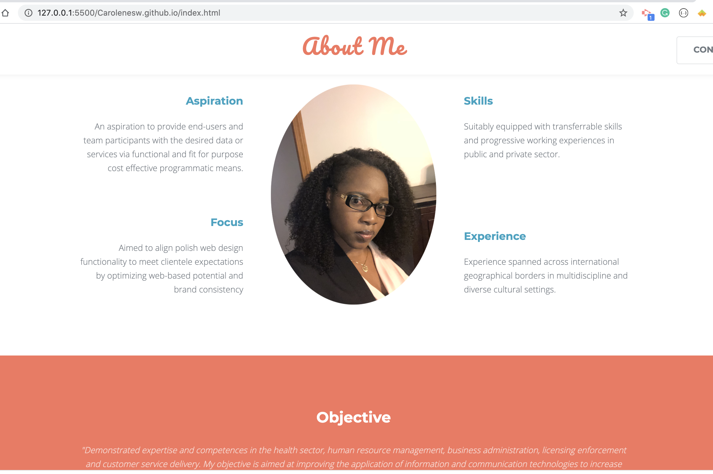

# Carolenesw.github.io

# Portfolio 

## User Story 

Create a Profile/About Me responsive design web application that showcase my applications to potential employers. 

## Techonology

- HTML/CSS
- JavaScript
- Bootstrap
- Google Fonts  
- Template io

## Userbility

- This website should render on extra small screens to large screen sizes, with responisve layout
    - On extra smaller screens website should take up the entire page
    - On small and larger screens website should have margins on the left and right of the page

- Page should follow HTML validation services

- Website must contains developer personal information:
    - Developer's bio 
    - Name
    - Picture
    - Active links to social media 
        - GitHub profile & LinkedIn page
        - Email address and phone number
        - Link to a PDF of your resume
    - List of projects with the following:
        - Project title
        - Link to the deployed version
        - Link to the GitHub repository

## link

https://github.com/Carolenesw/Carolenesw.github.io

## Image

